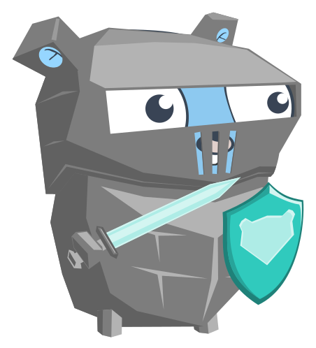

# Bouncer



Bouncer is the gatekeeper between the podded ecosystem and CCPs ESI API.
It serves two main functions;
1. To provide metrics on the response times and codes of all requests
2. To enforce a global rate limit on requests

## Installation

### Dependencies

You should have a memcached server running and accessible (I won't cover this here)

### Bouncer

### Server

The bouncer server can be run by cloning this repo, then using make to build the executable

```shell script
git clone https://github.com/podded/bouncer
cd bouncer
make
```

### Client

Go get can fetch down the latest bouncer version

```shell script
go get -u https://github.com/podded/bouncer
```

## Usage

### Server

The bouncer server is designed to be run standalone on a machine. it can be invoked by running the binary built in the bin folder

```bash
./bin/bouncer_server
```

There are a number of configuration options that can be set (either in env variables or a .env file in the working directory)
Examples of these can be found in `.env`

### Client

The client should be embedded within the service which will be making a request to ESI. Code for this would look like;

```go
bc, version, err := client.NewBouncer(bouncerAddress, maxTimeout, descriptor)
if err != nil {
    log.Fatalf("Failed to connect to bouncer....: %s\n", err)
}
log.Printf("Connected to bouncer. version %s\n", version)

r := bouncer.Request{
    URL:    fmt.Sprintf("https://esi.evetech.net/v1/killmails/%d/%s/", idhp.ID, idhp.Hash),
    Method: "GET",
}

resp, _, err := bc.MakeRequest(r)
if err != nil {
    log.Printf("ERROR making esi request for id %d: %s", killid, err)
    continue
}


```

## Contributing
Pull requests are welcome. For major changes, please open an issue first to discuss what you would like to change.

Please make sure to update tests as appropriate.

## License
[MIT](https://choosealicense.com/licenses/mit/)